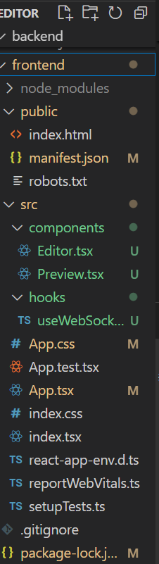

# Real-time Markdown Editor with Live Preview

## Objective
Create a real-time Markdown editor using Node.js and React. This editor should convert Markdown text to HTML in real-time and display the rendered HTML in a live preview pane.


## Installation
To set up the project locally, follow these steps:

1. **Clone the repository:**
   ```bash
   git clone <repository-url>
   cd <repository-folder>

2. **Install dependencies:**
Navigate to both the frontend and backend directories and run:

   ```bash
   npm install

3. **Start the application:**
Run server:

    ```bash
    cd backend
    node server

Run client: 

    ```bash
    cd frontend
    npm start   

## Usage
Open the browser and navigate to http://localhost:3000.
Type Markdown text in the input area.
The corresponding HTML output will be displayed in the live preview pane. 

## Technologies Used

 - Frontend: React ,TypeScript
 - Backend: Node , Express
 - Real-time Communication: WebSocket
 - Markdown Processing: markdown-it, marked
 - Libraries: lodash , prismjs , socket.io-client ,socket.io, ws
    
## File Structure

    


## Project Outcome

The Real-time Markdown Editor successfully demonstrates the following outcomes:

1. Real-time Markdown Conversion:
   - Users can type Markdown text, which is converted to HTML in real-time. This provides immediate visual feedback, enhancing the user experience.

2. User-friendly Interface:
   - The application features a clean and intuitive interface built with React and TypeScript, making it easy for users to understand and use.

3. Backend Integration:
   - The Node.js backend handles Markdown processing, simulating a more complex architecture that can handle additional features and functionalities in future iterations.

4. Stateless Operation:
   - The application operates without a database, making it lightweight and efficient for real-time interactions.

5. Syntax Highlighting:
   - Syntax highlighting in the Markdown editor improves readability and makes it easier for users to identify Markdown syntax.

6. Collaboration Capabilities:
   - Utilizing WebSocket allows for potential future expansions to support collaborative editing, where multiple users can work on the same document simultaneously.

7. Educational Value:
   - This project serves as a practical example of implementing full-stack development techniques, including real-time data handling, user interface design, and server-side processing.


